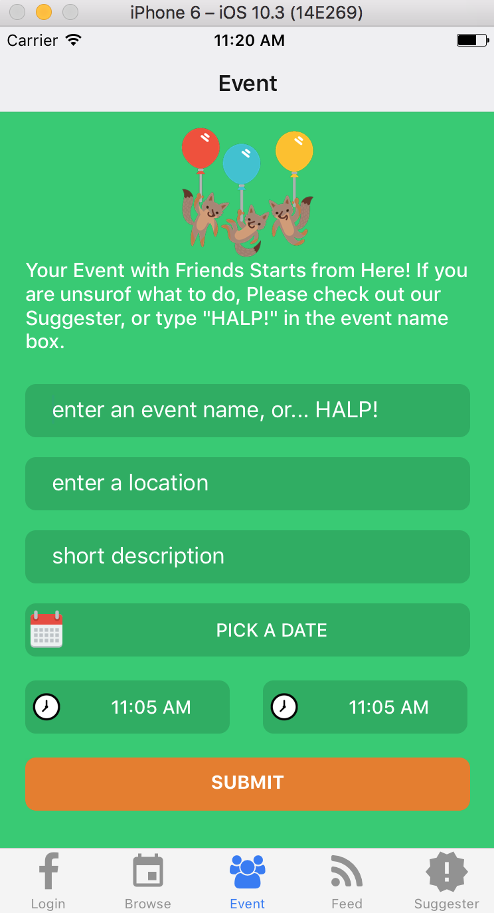
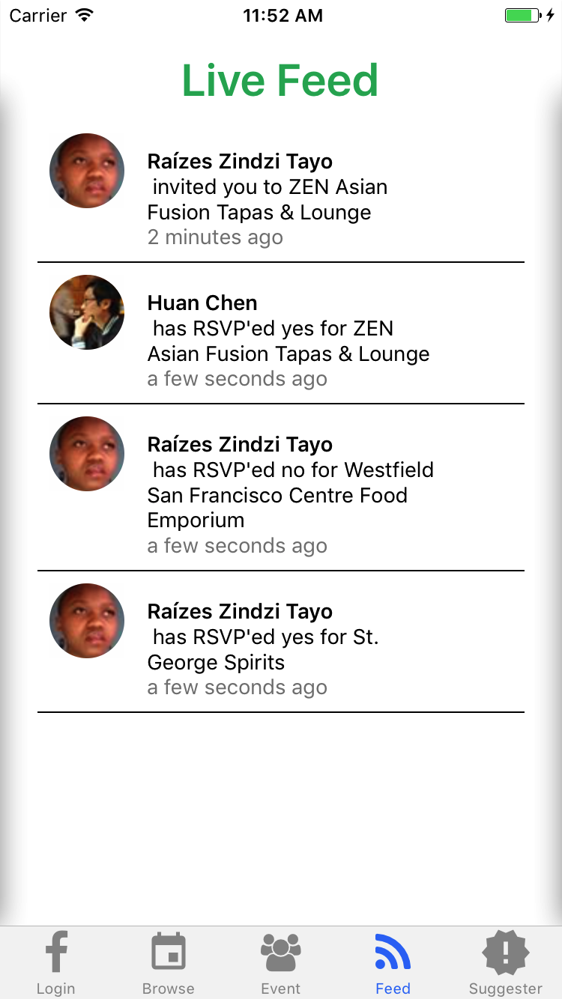
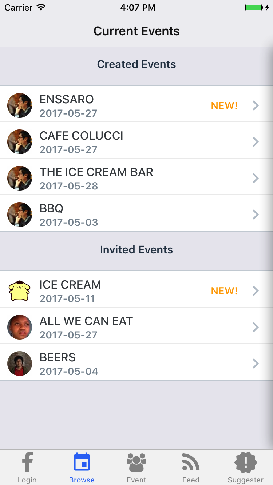
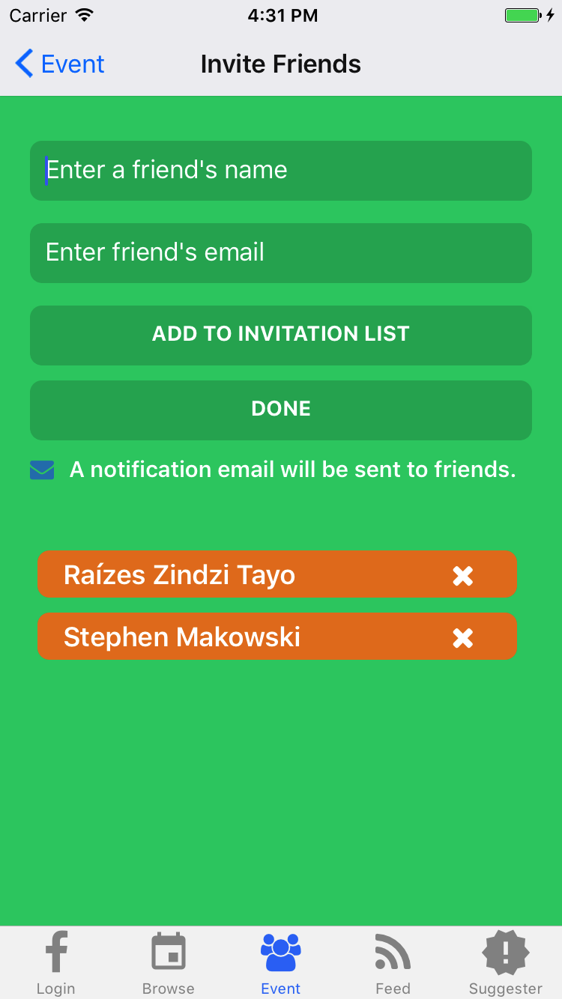
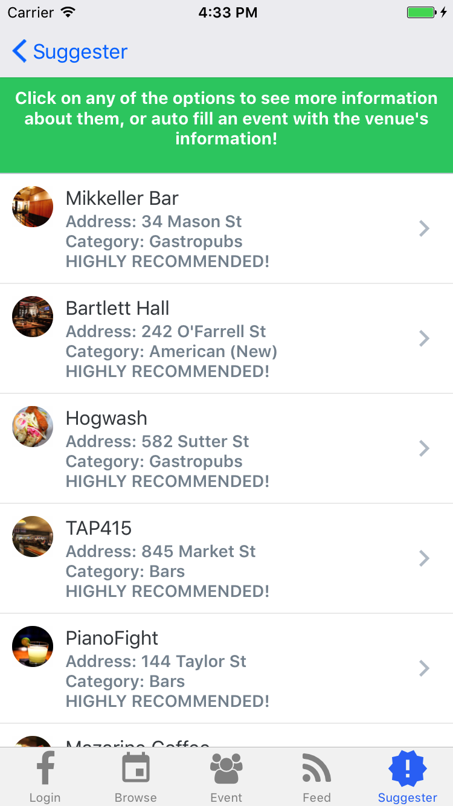
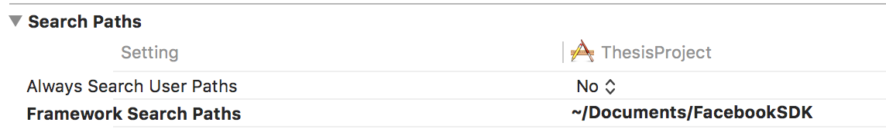

# Friendly

> An iOS app which allows user to create events and invite friends to events. Friends could propose new activities for an event and vote on activities.

# Screenshots







## Team

  - Huan Chen
  - Stephen Makowski 
  - Tayo Jolaosho

## Table of Contents

1. [Usage](#Usage)
1. Technologies Used
1. [Requirements](#requirements)
1. [Development](#development)
    1. [Installing Dependencies](#installing-dependencies)
1. [Roadmap](https://docs.google.com/document/d/1tJq9zj5AP2UCyE2M4mSyZ2UbmC5HB3WWCl2WYJIGBa0/edit)
1. [Contributing](#contributing)

## Usage

- Use Facebook authentication to login and logout.
- Click on 'Event' tab to create a new event by typing in event name, event location, event date, and event time. If user needs suggestions regarding what to do and where to go, he/she can enter 'HALP!' in the event name field to get suggestions.
- Event creators can invite friends to their events. Friends'names are autocompleted and emails are autopopulated if they are in our database. 
- Click on 'Browse' tab to view all active events including created events and invited events. User can click on each indivial event to view event details and propose new activities.
- New activities are shown in the event detail view once they are created. They can be voted up. 
- Live Feed, all activities related to the user are displayed in live feed. Clicking on each live feed will take user to the event detail view.
- Invited friends will receive an email about the invitation. They can RSVP or decline the invitation in event detail view.

## Technologies Used
- React Native
- Redux
- React Navigation
- Express/Node.js
- MySQL
- Socket.io
- Mailgun
- Yelp API

## Requirements
- "bluebird": "^3.5.0",
- "body-parser": "^1.17.1",
- "dotenv": "^4.0.0",
- "express": "^4.15.2",
- "jquery": "^3.2.1",
- "mailgun-js": "^0.10.1",
- "moment": "^2.18.1",
- "mysql": "^2.13.0",
- "node-yelp-fusion": "^1.0.4",
- "nodemon": "^1.11.0",
- "react": "16.0.0-alpha.6",
- "react-native": "0.43.2",
- "react-native-autocomplete-input": "^3.1.2",
- "react-native-datepicker": "^1.4.6",
- "react-native-elements": "^0.10.3",
- "react-native-fbsdk": "^0.5.0",
- "react-native-geocoder": "^0.4.8",
- "react-native-geocoding": "^0.1.0",
- "react-native-icons": "^0.7.1",
- "react-native-modal-dropdown": "^0.4.2",
- "react-native-prompt": "^1.0.0",
- "react-native-vector-icons": "^4.0.1",
- "react-navigation": "git+https://github.com/react-community/react-navigation.git",
- "react-redux": "^5.0.3",
- "redux": "^3.6.0",
- "redux-logger": "^3.0.1",
- "redux-thunk": "^2.2.0",
- "sequelize": "^3.30.4",
- "socket.io": "^1.7.3",
- "socket.io-client": "^1.7.3",
- "yelp-fusion": "^1.0.3",
- "yelp-fusion-v3": "0.0.8"

## Development

### Installing Dependencies

From within the root directory:

```sh
npm install
```

### Roadmap

View the project roadmap [here](https://docs.google.com/document/d/1tJq9zj5AP2UCyE2M4mSyZ2UbmC5HB3WWCl2WYJIGBa0/edit)

## Contributing

See [CONTRIBUTING.md](CONTRIBUTING.md) for contribution guidelines.

## Run App in Simulator
- Clone the repo
- run 'npm install'
- Download [Facebook sdk](https://developers.facebook.com/docs/ios/)
- Unzip the sdk and put all files under a folder called FacebookSDK and then put FacebookSDK folder under /documents 
- In Xcode, in 'Build Settings', set up the search path of 'Frame Search Path'
- 
- start server by running 'npm run server-dev' in Terminal
- run 'react-native run-ios' in Terminal 


## Run Tests
Before running any server tests, please load schema to setup friendlyTest server.
schemaTest.sql can be found under the root directory of this repo. 
mysql -u root -p < schemaTest.sql
- run mocha in terminal for testing server
- run npm run test -- --verbose in terminal for testing React Native components
